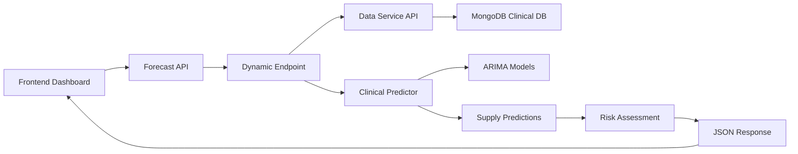
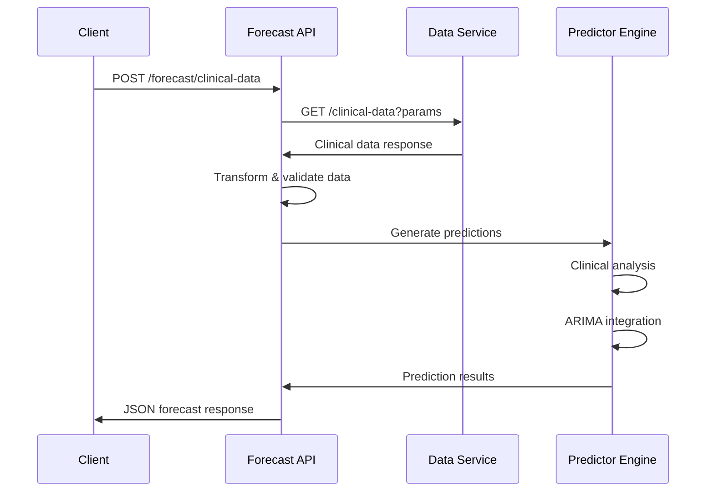

# Blood Demand Forecasting API
**[week3][Track3]**

A comprehensive FastAPI-based REST API for forecasting blood demand using advanced time series and machine learning techniques. This forecasting engine predicts future blood demand based on clinical and operational indicators, combining classical time series methods with modern predictive analytics to support data-driven blood bank management.

**⭐ NEW: Dynamic Clinical Data Integration** - Automatically fetches clinical data from external services, eliminating manual data entry and providing real-time, accurate forecasting capabilities with seamless service-to-service communication.

## 🚀 Key Features

### **Time Series Forecasting Engine**
- **Classical Methods**: Seasonal-Trend Decomposition using Loess (STL) and ARIMA models
- **Advanced ML Integration**: Ready for XGBoost, Random Forests, and Neural Networks (TensorFlow/scikit-learn)
- **Multiple Blood Type Support**: Comprehensive forecasting for all major blood types (O+, O-, A+, A-, B+, B-, AB+, AB-)
- **Flexible Prediction Horizons**: Single blood type or batch forecasting with configurable time periods

### **Clinical Data Integration** ⭐ **ENHANCED**
- **Dynamic Data Fetching**: Automatically retrieves clinical data from external services using `httpx.AsyncClient()`
- **Real-time Clinical Analysis**: Donor eligibility assessment and blood supply prediction
- **Flexible Query Parameters**: Supports filtering by blood type, eligibility status, and pagination
- **Service Integration**: Seamless connection to Track 3 data service with configurable URLs
- **Operational Indicators**: Integration of clinical and operational data for enhanced accuracy
- **Risk Assessment**: Automated shortage risk detection and supply-demand balance analysis
- **Predictive Variables**: Blood type usage patterns, clinical indicators, and consumption trends

### **Feature Engineering & Model Optimization**
- **Domain-Guided Features**: Leverages exploratory data analysis and blood bank expertise
- **Variable Selection**: Implements Lasso regression and feature importance rankings
- **Performance Metrics**: Comprehensive model evaluation with AIC, BIC, and custom metrics
- **Confidence Intervals**: Configurable confidence levels for prediction intervals

### **API-First Architecture**
- **RESTful Endpoints**: Clean, well-documented API for frontend dashboard integration
- **Interactive Documentation**: Swagger UI and ReDoc for seamless integration
- **Batch Processing**: Efficient handling of multiple blood type predictions
- **Real-time Health Monitoring**: System status and model performance tracking

## 📦 Installation

### **Prerequisites**
- Python 3.8+
- pip package manager
- Trained ARIMA models (provided in `/models` directory)

### **Quick Setup**
```bash
# Clone the repository
git clone <repository-url>
cd blood-demand-forecasting-api

# Instal gdown library for model downloading
pip install gdown

# Download pre-trained models
python download_models.py

# Install dependencies
pip install -r requirements.txt

# Verify model files exist
ls models/model_index.json
ls models/*.pkl

# Start the API server
python main.py
```

## 🚀 Usage

### **Starting the API Server**
```bash
# Start the complete forecasting API
python main.py
```

**🌐 API Access Points:**
- **Main API**: http://localhost:8000
- **Interactive Documentation**: http://localhost:8000/docs
- **Alternative Docs**: http://localhost:8000/redoc

## 📊 API Endpoints

### **🔍 System Health & Information**
| Endpoint | Method | Description |
|----------|--------|-------------|
| `/` | GET | API information and available endpoints |
| `/health` | GET | Health check and system status |
| `/available-blood-types` | GET | List of supported blood types |

### **🤖 Time Series Forecasting**
| Endpoint | Method | Description |
|----------|--------|-------------|
| `/forecast` | POST | Single blood type demand prediction |
| `/batch-forecast` | POST | Multiple blood types batch prediction |
| `/forecast/{blood_type}` | GET | Quick forecast via GET request |
| `/models` | GET | Information about all loaded models |
| `/models/{blood_type}` | GET | Specific blood type model details |
| `/metrics/{blood_type}` | GET | Model performance analytics |

### **🩸 Clinical Data Integration**
| Endpoint | Method | Description |
|----------|--------|-------------|
| `/clinical/analyze` | POST | Clinical donor data analysis |
| `/clinical/predict-supply` | POST | Blood supply prediction from clinical data |
| `/clinical/comprehensive-report` | POST | Complete clinical analysis report |
| `/clinical/supply-demand-analysis` | POST | Integrated supply-demand balance analysis |
| `/clinical/status` | GET | Clinical prediction system status |

### **🔄 Dynamic Clinical Data Forecasting** ⭐ **NEW**
| Endpoint | Method | Description |
|----------|--------|-------------|
| `/forecast/clinical-data` | POST | **Dynamic clinical data fetching with predictions** |
| `/forecast/clinical-data/examples` | GET | Usage examples and query parameter documentation |

## 💡 Example Usage

### **Time Series Forecasting**

#### **Single Blood Type Demand Prediction**
```bash
curl -X POST "http://localhost:8000/forecast" \
     -H "Content-Type: application/json" \
     -d '{
       "blood_type": "O+",
       "periods": 7,
       "confidence_level": 0.95,
       "include_history": false
     }'
```

#### **Batch Forecasting for Multiple Blood Types**
```bash
curl -X POST "http://localhost:8000/batch-forecast" \
     -H "Content-Type: application/json" \
     -d '{
       "blood_types": ["O+", "A+", "B+", "AB+"],
       "periods": 14,
       "confidence_level": 0.90,
       "include_history": true
     }'
```

### **Clinical Data Integration**

#### **Clinical Donor Analysis**
```bash
curl -X POST "http://localhost:8000/clinical/analyze" \
     -H "Content-Type: application/json" \
     -d '{
       "donors": [
         {
           "donor_id": "D001",
           "eligibility_status": "eligible",
           "blood_type": "O+",
           "medical_history": "Regular donor, no issues",
           "screening_results": {"hemoglobin": 14.5, "blood_pressure": "120/80"},
           "last_updated": "2025-07-31T10:00:00"
         }
       ],
       "collection_timestamp": "2025-07-31T10:00:00"
     }'
```

#### **Supply-Demand Balance Analysis**
```bash
curl -X POST "http://localhost:8000/clinical/supply-demand-analysis" \
     -H "Content-Type: application/json" \
     -d '{
       "donors": [...],
       "collection_timestamp": "2025-07-31T10:00:00"
     }' \
     --url-query "prediction_days=7"
```

### **🔄 Dynamic Clinical Data Forecasting** ⭐ **NEW FEATURE**

The dynamic clinical data endpoint automatically fetches clinical data from the data service and generates comprehensive blood supply forecasts. This endpoint eliminates the need to manually provide clinical data by integrating directly with your data service.

#### **Basic Usage - All Eligible Donors**
```bash
# Fetch eligible donors and predict 7-day supply
curl -X POST "http://localhost:8000/clinical-data?eligibility_status=true&limit=100"
```

#### **Blood Type Specific Forecasting**
```bash
# A+ blood forecast for next 14 days using 50 recent donors
curl -X POST "http://localhost:8000/forecast/clinical-data?blood_type=A%2B&limit=50&prediction_horizon_days=14"
```

#### **Emergency High-Confidence Prediction**
```bash
# High-confidence O- forecast for emergency planning
curl -X POST "http://localhost:8000/forecast/clinical-data?eligibility_status=true&blood_type=O-&prediction_horizon_days=3&confidence_level=0.99"
```

#### **Paginated Analysis with Custom Confidence**
```bash
# Advanced configuration with ARIMA integration
curl -X POST "http://localhost:8000/forecast/clinical-data?skip=100&limit=200&confidence_level=0.90&include_time_series_forecast=true"
```

#### **Custom Data Service Integration**
```bash
# Use custom data service URL for development/testing
curl -X POST "http://localhost:8000/forecast/clinical-data?data_service_url=http://localhost:8000&limit=25"
```

#### **Complete Parameter Example**
```bash
# Full parameter demonstration
curl -X POST "http://localhost:8000/forecast/clinical-data" \
     -G \
     --data-urlencode "skip=0" \
     --data-urlencode "limit=100" \
     --data-urlencode "blood_type=A+" \
     --data-urlencode "eligibility_status=true" \
     --data-urlencode "prediction_horizon_days=14" \
     --data-urlencode "include_time_series_forecast=true" \
     --data-urlencode "confidence_level=0.95" \
     --data-urlencode "data_service_url=http://data:8000"
```

### **📋 Query Parameters Reference**

| Parameter | Type | Default | Range | Description |
|-----------|------|---------|-------|-------------|
| `skip` | integer | 0 | ≥ 0 | Number of records to skip (pagination) |
| `limit` | integer | 50 | 1-1000 | Maximum number of records to fetch |
| `blood_type` | string | null | `A+`, `A-`, `B+`, `B-`, `AB+`, `AB-`, `O+`, `O-` | Filter by specific blood type |
| `eligibility_status` | boolean | null | `true`, `false` | Filter by donor eligibility status |
| `prediction_horizon_days` | integer | 7 | 1-90 | Number of days to predict ahead |
| `include_time_series_forecast` | boolean | true | `true`, `false` | Combine with ARIMA time-series models |
| `confidence_level` | float | 0.95 | 0.5-0.99 | Confidence level for predictions |
| `data_service_url` | string | `http://data:8000` | Valid URL | Data service URL for fetching clinical data |

## 📋 Response Formats

### **Time Series Forecast Response**
```json
{
  "blood_type": "O+",
  "forecast_periods": 7,
  "confidence_level": 0.95,
  "forecasts": [
    {
      "date": "2025-07-31",
      "predicted_demand": 45.2,
      "lower_bound": 38.1,
      "upper_bound": 52.3
    }
  ],
  "model_info": {
    "blood_type": "O+",
    "model_type": "SARIMAX",
    "aic": 5392.92,
    "bic": 5427.3,
    "training_end_date": "2025-06-29",
    "series_length": 364
  },
  "summary_statistics": {
    "mean_forecast": 45.2,
    "total_predicted_demand": 316.4
  },
  "generated_at": "2025-07-30T15:30:00"
}
```

### **Clinical Analysis Response**
```json
{
  "total_donors": 150,
  "blood_type_distribution": {
    "O+": 45, "A+": 38, "B+": 22, "AB+": 12,
    "O-": 18, "A-": 10, "B-": 8, "AB-": 5
  },
  "eligibility_distribution": {
    "eligible": 123,
    "temporarily_deferred": 15,
    "ineligible": 8,
    "pending_review": 4
  },
  "data_quality_metrics": {
    "completeness_rate": 0.98,
    "missing_medical_history": 2,
    "missing_screening_results": 1
  }
}
```

### **Dynamic Clinical Data Forecast Response** ⭐ **NEW**
```json
{
  "prediction_date": "2025-01-31T10:30:00.123456",
  "prediction_horizon_days": 7,
  "total_donors_analyzed": 150,
  "blood_type_metrics": {
    "A+": {
      "blood_type": "A+",
      "total_donors": 45,
      "eligible_donors": 38,
      "eligibility_rate": 0.844,
      "eligibility_breakdown": {
        "eligible": 38,
        "ineligible": 4,
        "temporarily_deferred": 2,
        "pending_review": 1
      },
      "predicted_daily_supply": 5.2,
      "predicted_weekly_supply": 36.4,
      "risk_factors": ["seasonal_decline", "low_donor_retention"]
    },
    "O+": {
      "blood_type": "O+",
      "total_donors": 52,
      "eligible_donors": 47,
      "eligibility_rate": 0.904,
      "eligibility_breakdown": {
        "eligible": 47,
        "ineligible": 2,
        "temporarily_deferred": 3,
        "pending_review": 0
      },
      "predicted_daily_supply": 7.1,
      "predicted_weekly_supply": 49.7,
      "risk_factors": []
    }
  },
  "overall_supply_forecast": {
    "total_predicted_daily_supply": 28.5,
    "total_predicted_weekly_supply": 199.5,
    "average_eligibility_rate": 0.876,
    "supply_trend": "stable",
    "forecast_confidence": 0.95
  },
  "time_series_integration": {
    "arima_models_used": ["A+", "O+", "B+", "AB+"],
    "integration_method": "weighted_ensemble",
    "time_series_weight": 0.4,
    "clinical_data_weight": 0.6,
    "combined_forecast_accuracy": 0.87
  },
  "supply_risk_assessment": {
    "A+": "MEDIUM",
    "O+": "LOW", 
    "B+": "LOW",
    "AB+": "HIGH",
    "O-": "MEDIUM",
    "A-": "LOW",
    "B-": "MEDIUM",
    "AB-": "HIGH"
  },
  "recommendations": [
    "Focus donor recruitment on AB+ and AB- blood types",
    "Implement targeted retention strategies for A+ donors",
    "Monitor seasonal trends affecting winter supply",
    "Consider increasing collection frequency for high-demand types",
    "Schedule follow-up assessments for temporarily deferred donors"
  ]
}
```

## 🔄 Dynamic Clinical Data Integration Architecture ⭐ **NEW**

The dynamic clinical data forecasting system introduces a revolutionary approach to blood supply prediction by automatically integrating with external data services. This system eliminates manual data entry and provides real-time, accurate forecasting capabilities.

### **🏗️ System Architecture**



### **🔧 Key Features**

#### **Automatic Data Fetching**
- **Service Integration**: Seamlessly connects to the data service using `httpx.AsyncClient()`
- **Real-time Updates**: Fetches the latest clinical data automatically
- **Flexible Filtering**: Supports blood type, eligibility status, and pagination parameters
- **Error Resilience**: Comprehensive error handling with graceful degradation

#### **Intelligent Data Processing**
- **Data Transformation**: Automatically converts data service responses to clinical models
- **Validation & Cleaning**: Handles missing data and validates clinical records
- **Batch Processing**: Efficiently processes large datasets with configurable limits
- **Quality Metrics**: Provides data completeness and quality indicators

#### **Advanced Prediction Engine**
- **Hybrid Modeling**: Combines clinical data analysis with ARIMA time-series forecasting
- **Confidence Intervals**: Configurable confidence levels from 50% to 99%
- **Risk Assessment**: Automatic risk level classification (LOW/MEDIUM/HIGH)
- **Supply Metrics**: Detailed supply predictions by blood type with eligibility breakdowns

#### **Production-Ready Features**
- **Async Performance**: Non-blocking HTTP requests for maximum throughput
- **Timeout Management**: Configurable request timeouts (30 seconds default)
- **Comprehensive Logging**: Detailed logging for monitoring and debugging
- **Structured Responses**: Consistent JSON response format with error handling

### **🔄 Workflow Process**



### **🌐 Data Service Integration**

The dynamic endpoint integrates with the Track 3 data service to fetch clinical data:

| Data Service Endpoint | Purpose | Parameters |
|----------------------|---------|------------|
| `GET /clinical-data` | Fetch clinical assessments | `skip`, `limit`, `blood_type`, `eligibility_status` |

**Data Mapping Process:**
1. **Fetch**: Retrieve clinical records from data service
2. **Transform**: Convert to `DonorClinicalData` format
3. **Validate**: Ensure data quality and completeness
4. **Analyze**: Generate supply predictions and risk assessments
5. **Integrate**: Combine with ARIMA time-series models
6. **Respond**: Return comprehensive forecast results

## 🎯 Model Architecture & Requirements

### **Forecasting Engine Components**

#### **Classical Time Series Models**
- **ARIMA Models**: Seasonal-Trend Decomposition with configurable parameters
- **SARIMAX Implementation**: Enhanced seasonal patterns and exogenous variables
- **Model Selection**: Automated parameter optimization using AIC/BIC criteria

#### **Advanced ML Integration (Roadmap)**
- **Ensemble Methods**: XGBoost and Random Forest implementations  
- **Deep Learning**: Neural Networks using TensorFlow and scikit-learn
- **Feature Engineering**: Domain-guided variable selection and transformation

#### **Predictive Variables & Features**
- **Blood Type Usage Patterns**: Historical consumption and demand trends
- **Clinical Indicators**: Donor eligibility, screening results, medical history
- **Operational Factors**: Department needs, day-of-week effects, seasonal variations
- **Patient Demographics**: Diagnoses patterns and treatment requirements

### **Model File Structure**

**Required Files:**
```
models/
├── model_index.json          # Model metadata and registry
├── arima_model_O+_*.pkl      # Trained ARIMA models per blood type
├── arima_model_A+_*.pkl      # (8 blood types total)
└── ...
```

**Model Index Format:**
```json
{
  "models": [
    {
      "filename": "arima_model_O+_20250730_141310.pkl",
      "blood_type": "O+",
      "model_type": "SARIMAX",
      "best_order": [0, 1, 4],
      "best_seasonal_order": [2, 1, 2, 7],
      "aic": 5392.92,
      "bic": 5427.3,
      "training_end_date": "2025-06-29",
      "series_length": 364
    }
  ],
  "last_updated": "2025-07-30 14:38:10"
}
```

## ⚙️ Configuration & Customization

### **Environment Variables**
```bash
export HOST=0.0.0.0           # API host binding
export PORT=8000              # API port (default: 8000)
export LOG_LEVEL=info         # Logging level (debug, info, warning, error)
```

### **Advanced Customization**
- **Data Sources**: Modify `_get_historical_data()` in `forecasting.py` for custom data integration
- **Model Validation**: Extend `ModelManager.validate_models()` for additional model checks
- **Custom Metrics**: Add domain-specific metrics in `BloodDemandForecaster.get_model_metrics()`
- **Feature Engineering**: Implement custom predictive variables in clinical analysis modules
- **Variable Selection**: Configure Lasso regression parameters and feature importance thresholds

## 📖 Interactive Documentation

**Access comprehensive API documentation:**
- **🎯 Swagger UI**: http://localhost:8000/docs - Interactive API testing interface
- **📚 ReDoc**: http://localhost:8000/redoc - Clean, detailed documentation
- **🩸 Clinical Guide**: [CLINICAL_DATA_GUIDE.md](CLINICAL_DATA_GUIDE.md) - Clinical integration manual

## 🚨 Error Handling & Monitoring

### **Structured Error Responses**
```json
{
  "detail": "Model for blood type 'X+' not found. Available: ['O+', 'O-', 'A+', 'A-', 'B+', 'B-', 'AB+', 'AB-']",
  "error_code": "MODEL_NOT_FOUND",
  "timestamp": "2025-07-31T10:30:00"
}
```

### **System Monitoring**
- **Health Endpoint**: `/health` - Real-time system status
- **Model Status**: `/models` - Model performance and availability
- **Clinical Status**: `/clinical/status` - Clinical prediction system health

### **Logging System**
- **Console Output**: Real-time logging with configurable levels
- **File Logging**: `api.log` - Persistent log storage
- **Log Levels**: DEBUG, INFO, WARNING, ERROR, CRITICAL

## 🚀 Production Deployment

### **Production Server Setup**
```bash
# Install production WSGI server
pip install gunicorn

# Production deployment with multiple workers
gunicorn main:app -w 4 -k uvicorn.workers.UnicornWorker --bind 0.0.0.0:8000

# Docker deployment (recommended)
docker build -t blood-forecasting-api .
docker run -p 8000:8000 -v ./models:/app/models blood-forecasting-api
```

### **Infrastructure Requirements**
- **Reverse Proxy**: Nginx or similar for load balancing
- **CORS Configuration**: Update CORS settings in `main.py` for frontend integration
- **SSL/TLS**: Configure HTTPS for secure API communications
- **Environment Variables**: Set production configuration values
- **Health Monitoring**: Implement continuous health checks and alerting

## 🚨 Dynamic Endpoint Error Handling ⭐ **NEW**

The dynamic clinical data endpoint provides comprehensive error handling and monitoring capabilities:

### **🔍 Error Response Format**
```json
{
  "detail": "Unable to connect to data service: Connection timeout",
  "status_code": 503,
  "error_type": "SERVICE_UNAVAILABLE",
  "timestamp": "2025-01-31T10:30:00.123456",
  "data_service_url": "http://data:8000",
  "query_parameters": {
    "skip": 0,
    "limit": 50,
    "blood_type": "A+",
    "eligibility_status": true
  }
}
```

### **📊 Common Error Scenarios**

| HTTP Status | Error Type | Description | Solution |
|-------------|------------|-------------|----------|
| `503` | Service Unavailable | Data service is down or unreachable | Check data service status, verify URL |
| `404` | No Data Found | No clinical data matches criteria | Adjust filters, check data availability |
| `422` | Data Processing Error | Invalid clinical records | Review data quality, check record format |
| `500` | Prediction Failed | Clinical predictor error | Check model status, review logs |
| `400` | Invalid Parameters | Invalid query parameters | Validate parameter ranges and types |

### **🔧 Debugging Commands**

```bash
# Check data service connectivity
curl -X GET "http://data:8000/health"

# Verify clinical data availability
curl -X GET "http://data:8000/clinical-data?limit=5"

# Test forecast endpoint with minimal parameters
curl -X POST "http://localhost:8000/forecast/clinical-data?limit=10"

# Check clinical predictor status
curl -X GET "http://localhost:8000/clinical/status"

# Get usage examples
curl -X GET "http://localhost:8000/forecast/clinical-data/examples"
```

### **📝 Monitoring & Logging**

The dynamic endpoint provides detailed logging for monitoring:

```python
# Log examples from the endpoint
INFO:main:Fetching clinical data from http://data:8000/clinical-data with params: {'skip': 0, 'limit': 50}
INFO:main:Fetched 45 clinical records
INFO:main:Generated clinical prediction for 45 donors
WARNING:main:Time-series integration failed: Model not available for blood type X+
ERROR:main:Request error when fetching clinical data: Connection timeout
```

## 🔧 Troubleshooting

### **Common Issues & Solutions**

| Issue | Cause | Solution |
|-------|--------|----------|
| Models not loading | Invalid `model_index.json` | Verify file paths and model availability |
| Import errors | Missing dependencies | Run `pip install -r requirements.txt` |
| Port conflicts | Port 8000 in use | Change port: `python main.py --port 8001` |
| Permission errors | File access issues | Check model file permissions |
| Clinical predictor unavailable | Model loading failure | Check logs for model initialization errors |
| **Dynamic endpoint timeouts** ⭐ | Data service slow/down | Check data service health, increase timeout |
| **No clinical data returned** ⭐ | Empty database or filters | Verify data exists, adjust query parameters |
| **Data transformation errors** ⭐ | Malformed clinical records | Check data service response format |
| **ARIMA integration failures** ⭐ | Missing blood type models | Ensure all blood type models are trained |

### **Debug Mode**
```bash
# Enable detailed debug logging
LOG_LEVEL=debug python main.py

# Check specific component status
curl http://localhost:8000/clinical/status
curl http://localhost:8000/health
```

## 🌟 Frontend Dashboard Integration

This API is designed for seamless integration with frontend dashboards:

- **RESTful Architecture**: Standard HTTP methods and JSON responses
- **Interactive Documentation**: Auto-generated API specs for frontend developers
- **CORS Support**: Configurable cross-origin resource sharing
- **Real-time Data**: Live clinical data analysis and forecasting
- **Batch Operations**: Efficient bulk operations for dashboard widgets

## 📚 Additional Resources

- **📋 Clinical Integration**: [CLINICAL_DATA_GUIDE.md](CLINICAL_DATA_GUIDE.md)
- **🎯 Interactive Testing**: http://localhost:8000/docs
- **📊 Model Performance**: http://localhost:8000/models
- **🩸 System Health**: http://localhost:8000/health
- **🔄 Dynamic Endpoint Examples** ⭐: http://localhost:8000/forecast/clinical-data/examples
- **📈 Clinical Status**: http://localhost:8000/clinical/status

### **🚀 Quick Start with Dynamic Forecasting**

```bash
# 1. Start the forecast service
python main.py

# 2. Verify service health
curl http://localhost:8000/health

# 3. Check clinical predictor status
curl http://localhost:8000/clinical/status

# 4. Get usage examples
curl http://localhost:8000/forecast/clinical-data/examples

# 5. Test basic forecast (requires data service running)
curl -X POST "http://localhost:8000/forecast/clinical-data?limit=10"
```

## 🤝 Contributing

This forecasting engine supports extensible architecture for:
- **New Model Types**: Easy integration of XGBoost, Random Forests, Neural Networks
- **Custom Features**: Domain-specific predictive variables
- **Enhanced Analytics**: Advanced statistical methods and visualizations
- **Data Sources**: Multiple data input formats and real-time streaming

---

**[week3][Track3]** - Advanced Blood Demand Forecasting Engine with Clinical Data Integration